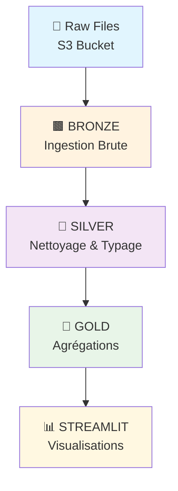
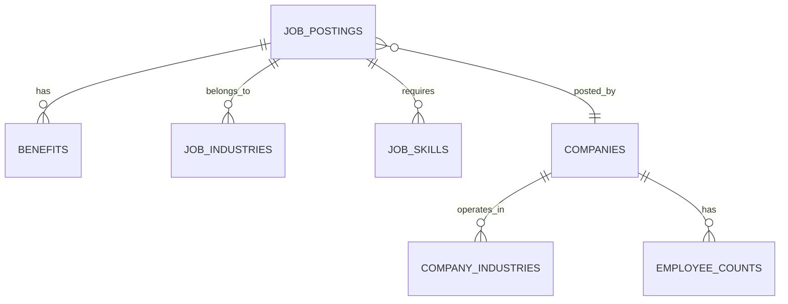

# 🔍 LinkedIn Job Analysis — Snowflake & Streamlit

<div align="center">


*Analyse de milliers d'offres d'emploi LinkedIn via une architecture Medallion moderne*

[🚀 Démo en Ligne](https://your-streamlit-app-url) • [📊 Dataset](https://s3://snowflake-lab-bucket/) • [📖 Documentation](#-documentation)

</div>

---

## 📋 Table des Matières

- [✨ Vue d'Ensemble](#-vue-densemble)
- [🏗️ Architecture Medallion](#-architecture-medallion)
- [📊 Analyses & Insights](#-analyses--insights)
- [🗂️ Structure du Projet](#-structure-du-projet)
- [🗄️ Modèle de Données](#-modèle-de-données)
- [📦 Données Source](#-données-source)
- [🚀 Démarrage Rapide](#-démarrage-rapide)
- [⚙️ Automatisation](#-automatisation)
- [🐛 Challenges & Solutions](#-challenges--solutions)
- [👥 Équipe](#-équipe)
- [📸 Visualisations](#-visualisations)
- [📄 Licence](#-licence)

---

## ✨ Vue d'Ensemble

Bienvenue dans ce projet d'analyse de données d'emploi ! 🎯

Ce projet transforme des milliers d'offres d'emploi LinkedIn brutes en insights actionnables grâce à une **architecture Medallion moderne** sur Snowflake. De l'ingestion brute à la visualisation interactive, découvrez comment analyser le marché du travail avec des technologies cloud.

### 🎯 Objectifs
- **📈 Analyser** les tendances du marché de l'emploi
- **🔍 Identifier** les secteurs en croissance
- **💰 Comparer** les rémunérations par poste et industrie
- **📊 Visualiser** les données de manière interactive

### 🛠️ Technologies Utilisées
- **☁️ Snowflake** : Data Warehouse cloud
- **🐍 Python** : Traitement et analyse
- **🌊 Streamlit** : Interface utilisateur
- **📦 AWS S3** : Stockage des données brutes

---

## 🏗️ Architecture Medallion

Notre pipeline de données suit l'architecture **Medallion** pour une qualité et une traçabilité optimales :



| Couche | Description | Technologies |
|--------|-------------|-------------|
| **🟫 Bronze** | Données brutes ingérées telles quelles | `VARCHAR`, `VARIANT` |
| **🩶 Silver** | Données nettoyées et typées | Tables structurées |
| **🥇 Gold** | Agrégations prêtes pour l'analyse | Tables optimisées |
| **📊 Streamlit** | Interface de visualisation | Application web interactive |

---

## 📊 Analyses & Insights

Découvrez les 5 analyses clés réalisées sur les données d'emploi :

| # | 📈 Analyse | 🎯 Objectif | 💡 Insights |
|---|-----------|------------|------------|
| 1️⃣ | **Top 10 Postes Populaires** | Identifier les métiers en tension | Métiers tech et data en forte demande |
| 2️⃣ | **Top Rémunérations** | Comparer les salaires par poste | Écart significatif selon l'industrie |
| 3️⃣ | **Taille Entreprises** | Répartition par taille (TPE → GE) | Prédominance des PME |
| 4️⃣ | **Secteurs d'Activité** | Top 20 secteurs recruteurs | Tech, Finance, Santé leaders |
| 5️⃣ | **Types d'Emploi** | CDI, CDD, Stage, etc. | CDI majoritaire |

---

## 🗂️ Structure du Projet

```
📁 linkedin-job-analysis/
│
├── 📄 README.md                    # 📖 Ce fichier
│
├── 📁 sql/                        # 🗄️ Scripts SQL
│   ├── 01_setup.sql              # ⚙️ Configuration initiale
│   ├── 02_tables_bronze.sql      # 🟫 Création Bronze
│   ├── 03_load_bronze.sql        # 📥 Chargement données
│   ├── 04_tables_silver.sql      # 🩶 Création Silver
│   ├── 05_load_silver.sql        # 🔄 Transformation
│   ├── 06_quality_tests.sql      # ✅ Tests qualité
│   ├── 07_tables_gold.sql        # 🥇 Création Gold
│   ├── 08_analyses.sql           # 📊 Requêtes analyses
│   └── 09_automation.sql         # 🤖 Automatisation
│
├── 📁 streamlit/                  # 🌊 Application web
│   └── streamlit_app.py          # 🎨 Code Streamlit
│
└── 📁 assets/                     # 🖼️ Images & ressources
    ├── screenshots/              # 📸 Captures d'écran
    └── diagrams/                 # 📊 Diagrammes
```

---

## 🗄️ Modèle de Données

### 🟫 Bronze / Silver Layer



| Table | Description | Clés |
|-------|-------------|------|
| **job_postings** | Offres d'emploi détaillées | `job_id` (PK) |
| **companies** | Informations entreprises | `company_id` (PK) |
| **benefits** | Avantages par offre | `job_id` (FK) |
| **job_industries** | Secteurs par offre | `job_id` (FK) |
| **job_skills** | Compétences requises | `job_id` (FK) |
| **company_industries** | Secteurs entreprise | `company_id` (FK) |
| **employee_counts** | Effectifs entreprise | `company_id` (FK) |

### 🥇 Gold Layer

```
┌─────────────────────────────────────┐
│         🥇 TABLES GOLD              │
├─────────────────────────────────────┤
│  top_titres_par_industrie          │
│  top_salaires_par_industrie        │
│  repartition_taille_entreprise     │
│  repartition_secteur_activite      │
│  repartition_type_emploi           │
└─────────────────────────────────────┘
```

---

## 📦 Données Source

Les données sont stockées dans un bucket S3 public pour faciliter la reproduction :

| 📁 Fichier | 📋 Format | 📊 Description | 📏 Taille |
|------------|-----------|----------------|-----------|
| `job_postings.csv` | CSV | Offres d'emploi complètes | ~50MB |
| `benefits.csv` | CSV | Avantages sociaux | ~5MB |
| `employee_counts.csv` | CSV | Effectifs entreprises | ~2MB |
| `job_skills.csv` | CSV | Compétences requises | ~10MB |
| `companies.json` | JSON | Données entreprises | ~15MB |
| `company_industries.json` | JSON | Secteurs entreprise | ~3MB |
| `company_specialities.json` | JSON | Spécialités | ~2MB |
| `job_industries.json` | JSON | Secteurs par offre | ~8MB |

**📍 Bucket S3 :** `s3://snowflake-lab-bucket/`

---

## 🚀 Démarrage Rapide

### 📋 Prérequis
- ✅ [Compte Snowflake](https://signup.snowflake.com/) (30 jours gratuit)
- ✅ Notions de base SQL et Python
- ✅ Navigateur web moderne

### 🛠️ Installation en 4 Étapes

1. **🔐 Créer un compte Snowflake**
   ```bash
   # Aller sur https://signup.snowflake.com/
   # Créer un compte gratuit
   ```

2. **⚙️ Configurer l'environnement**
   ```sql
   -- Exécuter 01_setup.sql pour créer :
   -- • Base de données
   -- • Schémas Bronze/Silver/Gold
   -- • Stage S3
   -- • Formats de fichier
   ```

3. **📥 Charger les données**
   ```bash
   # Exécuter les scripts dans l'ordre :
   02_tables_bronze.sql
   03_load_bronze.sql
   04_tables_silver.sql
   05_load_silver.sql
   06_quality_tests.sql
   07_tables_gold.sql
   08_analyses.sql
   ```

4. **🌊 Lancer Streamlit**
   ```bash
   # Dans Snowflake :
   # • Créer une Streamlit App
   # • Sélectionner "Run on warehouse"
   # • Coller le code de streamlit_app.py
   # • Cliquer sur "Run"
   ```

### 🎯 Résultat
🎉 Votre application Streamlit est maintenant accessible avec 5 analyses interactives !

---

## ⚙️ Automatisation

Le pipeline est entièrement automatisé pour une maintenance minimale :

| 🔄 Mécanisme | ⚡ Fréquence | 📝 Description |
|--------------|-------------|----------------|
| **Snowpipe** | Temps réel | Chargement automatique S3 → Bronze |
| **Task B→S** | Toutes les 60 min | Nettoyage Bronze → Silver |
| **Task S→G** | Toutes les 70 min | Agrégations Silver → Gold |

```sql
-- Exemple de Snowpipe
CREATE PIPE my_pipe
AUTO_INGEST = TRUE
AS COPY INTO bronze.job_postings
FROM @my_stage;
```

---

## 🐛 Challenges & Solutions

| 🚨 Problème | 💡 Solution Technique |
|-------------|----------------------|
| **Timestamps Unix** | `TO_TIMESTAMP_NTZ(CAST(ts/1000 AS BIGINT))` |
| **IDs flottants** | `SPLIT_PART(company_name, '.', 1)` |
| **Doublons** | `ROW_NUMBER() OVER(...) + QUALIFY` |
| **JSON imbriqués** | Stockage `VARIANT` puis extraction |

---

## 👥 Équipe

| 👤 Rôle | 🤝 Responsabilités |
|---------|-------------------|
| **David Atchori** | Setup, Bronze, Silver, Tests qualité |
| **Cédric BOIMIN** | Gold, Streamlit, Automatisation, Documentation |

---

## 📸 Visualisations

Découvrez les résultats de nos analyses à travers ces visualisations interactives :

### 1️⃣ Top 10 Postes les Plus Publiés par Industrie


### 2️⃣ Top 10 Postes les Mieux Rémunérés par Industrie


### 3️⃣ Répartition par Taille d'Entreprise


### 4️⃣ Répartition par Secteur d'Activité


### 5️⃣ Répartition par Type d'Emploi


---

## 📄 Licence

[](https://opensource.org/licenses/MIT)

Ce projet est distribué sous licence **MIT**. Voir le fichier [LICENSE](LICENSE) pour plus de détails.

---

<div align="center">

**⭐ Si ce projet vous a été utile, n'hésitez pas à lui donner une étoile !**

*Projet réalisé dans le cadre d'un laboratoire Data Engineering avec Snowflake*

[🔗 LinkedIn](https://linkedin.com/in/your-profile) • [📧 Email](mailto:your.email@example.com) • [🌐 Portfolio](https://your-portfolio.com)

</div>
